# Analisis Perbedaan Prediksi Penyakit Liver Berdasarkan Gender Menggunakan Machine Learning

**Penulis:** Harianto 
**Afiliasi:** Nusa cendekia research
**Email:** [masharry.net@gmail.com]  
**Tanggal Naskah:** April 2026

---

## Abstrak

Evaluasi model *machine learning* dalam prediksi penyakit klinis umumnya hanya mengandalkan metrik agregat, sehingga ketimpangan kinerja antar subkelompok dapat tersembunyi. Penelitian ini menganalisis apakah prediksi penyakit liver yang dihasilkan oleh tiga algoritma — *Logistic Regression*, *Random Forest*, dan *XGBoost* — menunjukkan perbedaan performa yang signifikan antara pasien laki-laki dan perempuan. Dataset yang digunakan adalah *Indian Liver Patient Dataset* (ILPD) yang terdiri dari 583 sampel dengan distribusi gender yang tidak seimbang (laki-laki 75,64%, perempuan 24,36%). Tiga skenario eksperimen dirancang: (1) model global dengan fitur gender, (2) model global tanpa fitur gender, dan (3) model terpisah per subkelompok gender. Evaluasi dilakukan menggunakan metrik *fairness* yang meliputi selisih *recall*, selisih F1, dan *false negative rate* (FNR) per gender. Hasil menunjukkan bahwa model terbaik secara keseluruhan adalah XGBoost pada Eksperimen 2 (tanpa fitur gender), dengan F1 = 0,8402, akurasi = 0,7692, dan AUC = 0,7782. Namun, seluruh konfigurasi menunjukkan *recall* yang lebih tinggi pada pasien laki-laki dibandingkan perempuan, yang mengindikasikan risiko *fairness* yang relevan secara klinis. *Random Forest* pada Eksperimen 3 (model khusus perempuan) memberikan FNR perempuan terendah sebesar 0,1111, sekaligus menunjukkan selisih *recall* paling kecil (+0,0649). Temuan ini menegaskan bahwa evaluasi agregat saja tidak cukup untuk penilaian model AI di bidang kesehatan, dan pelaporan berbasis subkelompok menjadi keharusan.

**Kata Kunci:** machine learning, penyakit liver, prediksi klinis, fairness, subkelompok gender, ILPD, XGBoost, Random Forest, false negative rate

---

## 1. Pendahuluan

Penyakit liver merupakan salah satu penyebab morbiditas dan mortalitas yang signifikan secara global. Deteksi dini melalui pemeriksaan parameter biokimia darah memiliki peran krusial dalam penanganan dan pencegahan komplikasi lebih lanjut. Dalam dekade terakhir, penerapan *machine learning* (ML) pada data rekam medis telah menunjukkan hasil yang menjanjikan untuk skrining penyakit liver secara otomatis [CITE].

Namun demikian, sebagian besar studi di bidang ini mengevaluasi performa model hanya berdasarkan metrik keseluruhan seperti akurasi, F1-*score*, dan *area under the ROC curve* (AUC). Pendekatan ini mengabaikan kemungkinan adanya ketimpangan kinerja model di antara subkelompok populasi yang berbeda. Dalam konteks klinis, ketimpangan ini berpotensi menyebabkan misdiagnosis yang lebih sering terjadi pada kelompok tertentu, misalnya pasien perempuan yang secara historis kurang terwakili dalam dataset medis [CITE].

Penelitian ini berfokus pada pertanyaan: *apakah model ML untuk prediksi penyakit liver berperilaku berbeda antara pasien laki-laki dan perempuan?* Untuk menjawab pertanyaan tersebut, penelitian ini mengadopsi pendekatan evaluasi berbasis subkelompok (*subgroup evaluation*) yang mengakomodasi dimensi *fairness* dalam kinerja model. Tiga pertanyaan penelitian utama dirumuskan sebagai berikut:

1. Apakah *Logistic Regression*, *Random Forest*, dan XGBoost menghasilkan performa prediksi yang berbeda untuk pasien laki-laki dan perempuan?
2. Apakah evaluasi berbasis subkelompok mengungkap masalah *fairness* yang tidak terlihat dalam metrik agregat?
3. Apakah model yang dilatih secara terpisah per gender menghasilkan kinerja yang lebih adil dibandingkan model global?

Kontribusi utama penelitian ini adalah:
- Rancangan eksperimen tiga skenario yang sistematis untuk menganalisis dampak gender pada prediksi penyakit liver
- Evaluasi metrik *fairness* komprehensif meliputi selisih *recall*, selisih F1, dan FNR per gender
- Rekomendasi konfigurasi model yang mempertimbangkan keseimbangan antara kinerja agregat dan keadilan subkelompok

---

## 2. Tinjauan Pustaka

### 2.1 Prediksi Penyakit Liver dengan Machine Learning

Berbagai penelitian telah mengeksplorasi penerapan ML untuk prediksi penyakit liver menggunakan *Indian Liver Patient Dataset* (ILPD) maupun dataset serupa. Ramana et al. [CITE] membandingkan beberapa algoritma klasifikasi pada ILPD dan melaporkan bahwa *Naive Bayes* dan *Decision Tree* memberikan kinerja yang kompetitif. Selanjutnya, Bendi dan Murmu [CITE] menunjukkan bahwa fitur enzim hati seperti *Alanine Aminotransferase* (SGPT) dan *Aspartate Aminotransferase* (SGOT) merupakan prediktor penting pada dataset ini. Metode *ensemble* seperti *Random Forest* dan *Gradient Boosting* secara konsisten mengungguli model sederhana dalam hal akurasi dan AUC [CITE].

### 2.2 Fairness dalam Machine Learning untuk Kesehatan

*Fairness* dalam sistem AI kesehatan telah menjadi topik riset yang berkembang pesat. Obermeyer et al. [CITE] mendokumentasikan bahwa algoritma prediksi risiko kesehatan komersial secara sistematis memberikan skor yang lebih rendah kepada pasien kulit hitam, meskipun tingkat keparahan penyakit setara dengan pasien kulit putih. Di domain yang lebih luas, Barocas et al. [CITE] mendefinisikan berbagai konsep *fairness* seperti *demographic parity*, *equalized odds*, dan *equal opportunity*, yang masing-masing memiliki implikasi berbeda dalam konteks kesehatan.

Untuk kasus skrining penyakit, *recall* (sensitivitas) dan *false negative rate* (FNR) menjadi metrik kritis. Tingginya FNR pada suatu subkelompok berarti sebagian besar pasien yang sesungguhnya sakit justru diprediksi sebagai sehat (*missed diagnosis*), yang memiliki konsekuensi klinis yang serius [CITE].

### 2.3 Gender sebagai Dimensi Fairness

Beberapa studi menunjukkan bahwa perbedaan biologis dan hormonal antara laki-laki dan perempuan dapat memengaruhi profil biomarker hati [CITE]. Wanita cenderung memiliki kadar enzim hati yang berbeda dan respons terhadap penyakit liver yang bervariasi dibandingkan pria. Selain itu, dataset medis yang ada seringkali memiliki ketidakseimbangan representasi gender, yang dapat menyebabkan model yang terlatih pada data tersebut cenderung "memihak" pada kelompok yang lebih dominan [CITE].

Penelitian ini mengisi celah tersebut dengan secara eksplisit mengukur selisih performa prediksi antara gender dan mengevaluasi apakah pendekatan pelatihan model yang berbeda dapat mengurangi ketimpangan tersebut.

---

## 3. Metodologi

Penelitian ini mengikuti kerangka kerja CRISP-DM (*Cross-Industry Standard Process for Data Mining*) yang terdiri dari enam tahapan: pemahaman bisnis, pemahaman data, persiapan data, pemodelan, evaluasi, dan pengemasan hasil penelitian.

### 3.1 Dataset

Dataset yang digunakan adalah *Indian Liver Patient Dataset* (ILPD) yang bersumber dari *UCI Machine Learning Repository* [CITE]. Dataset ini berisi rekam medis 583 pasien dari India Utara, yang mencakup sembilan parameter biokimia darah, satu variabel gender, dan satu label biner yang menunjukkan ada atau tidaknya penyakit liver.

**Tabel 1. Ringkasan Dataset ILPD**

| Karakteristik | Nilai |
|---|---|
| Jumlah sampel | 583 |
| Jumlah fitur | 11 (9 numerik + gender + target) |
| Jumlah kelas target | 2 (Penyakit Liver / Tidak) |
| Sampel penyakit liver | 416 (71,36%) |
| Sampel tanpa penyakit liver | 167 (28,64%) |
| Pasien laki-laki | 441 (75,64%) |
| Pasien perempuan | 142 (24,36%) |
| Nilai yang hilang (_missing values_) | 0 |

**Tabel 2. Fitur-Fitur dalam Dataset**

| Fitur | Keterangan |
|---|---|
| Age | Usia pasien (tahun) |
| Gender | Jenis kelamin (Male/Female) |
| TB (Total Bilirubin) | Kadar total bilirubin (mg/dL) |
| DB (Direct Bilirubin) | Kadar bilirubin langsung (mg/dL) |
| Alkphos (Alkaline Phosphotase) | Kadar alkalin fosfatase (IU/L) |
| Sgpt (Alanine Aminotransferase) | Kadar SGPT/ALT (IU/L) |
| Sgot (Aspartate Aminotransferase) | Kadar SGOT/AST (IU/L) |
| TP (Total Proteins) | Kadar total protein (g/dL) |
| ALB (Albumin) | Kadar albumin (g/dL) |
| A/G Ratio | Rasio albumin terhadap globulin |
| Target | Penyakit Liver = 1 / Tidak = 0 |

Analisis eksplorasi menunjukkan adanya **dua lapisan ketidakseimbangan** pada dataset: ketidakseimbangan kelas target (71,36% positif) dan ketidakseimbangan gender (75,64% laki-laki). Prevalensi penyakit liver per subkelompok juga berbeda: 73,47% pada pasien laki-laki versus 64,79% pada pasien perempuan, yang mengindikasikan adanya pergeseran distribusi subkelompok (*subgroup distribution shift*) yang harus dipertimbangkan dalam evaluasi.

**Gambar 1.** Distribusi target berdasarkan gender.

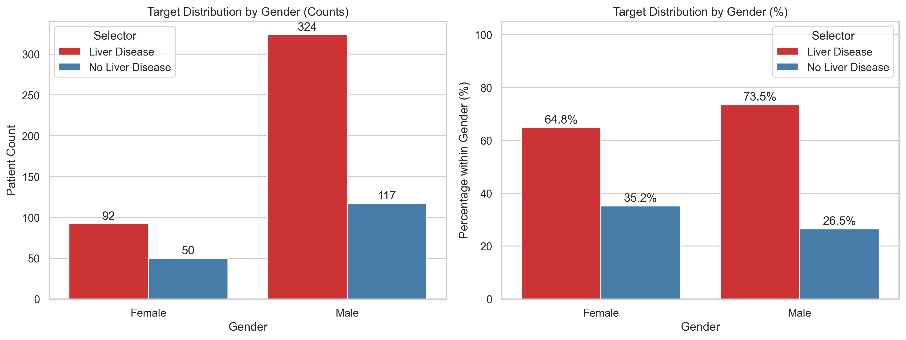

**Gambar 2.** Distribusi biomarker antar gender.

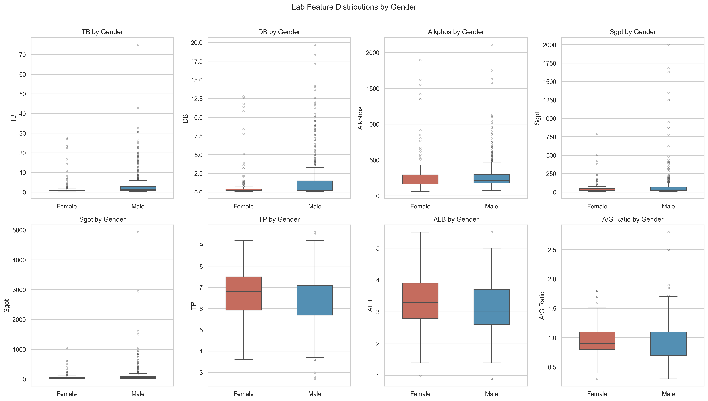

### 3.2 Persiapan Data

#### 3.2.1 Rekayasa Fitur

Tahapan persiapan data meliputi langkah-langkah berikut:

1. **Pengkodean target biner**: Penyakit Liver = 1, Tidak = 0
2. **Pengkodean gender biner**: Laki-laki = 1, Perempuan = 0; kolom Gender asli dipertahankan untuk evaluasi subkelompok
3. **Rekayasa fitur klinis**: Ditambahkan fitur `fractional_bilirubin = DB / (TB + 1×10⁻⁶)`, yaitu rasio bilirubin langsung terhadap bilirubin total, yang merupakan indikator klinis fungsi ekskresi hati
4. **Transformasi log1p**: Diterapkan pada fitur TB, DB, Alkphos, Sgpt, dan Sgot untuk mengompres distribusi yang sangat miring ke kanan (*right-skewed*) akibat adanya outlier ekstrem
5. **Penskalaan dengan RobustScaler**: Menggunakan median dan IQR sebagai basis penskalaan, lebih tahan terhadap outlier dibandingkan StandardScaler

#### 3.2.2 Pemisahan Data dengan Stratifikasi Empat Kelas

Mengingat adanya kelompok yang sangat kecil — perempuan tanpa penyakit liver berjumlah hanya 50 sampel dari total 583 (8,6%) — dilakukan stratifikasi empat kelas berdasarkan kombinasi Gender × Target. Hal ini memastikan proporsi setiap subkelompok terjaga secara proporsional antara data latih dan data uji.

**Tabel 3. Distribusi Data Latih dan Uji**

| Kelompok | Data Latih | Data Uji | Proporsi Latih | Proporsi Uji |
|---|---|---|---|---|
| Laki-laki + Penyakit Liver | 324 | 81 | – | – |
| Laki-laki + Tidak Sakit | 49 | 8 | – | – |
| Perempuan + Penyakit Liver | 53 | 18 | – | – |
| Perempuan + Tidak Sakit | 40 | 10 | – | – |
| **Total** | **466** | **117** | **80%** | **20%** |

> Proporsi "Perempuan tanpa Penyakit Liver" pada data latih adalah 8,58% (40/466) dan pada data uji 8,55% (10/117), membuktikan keberhasilan stratifikasi empat kelas.

### 3.3 Desain Eksperimen

Tiga skenario eksperimen dirancang untuk menganalisis pengaruh gender pada performa prediksi:

**Tabel 4. Ringkasan Desain Eksperimen**

| Eksperimen | Deskripsi | Fitur Input |
|---|---|---|
| Exp1 (Global + Gender) | Satu model untuk semua pasien, gender dimasukkan sebagai fitur | 11 fitur (termasuk gender) |
| Exp2 (Global − Gender) | Satu model untuk semua pasien, gender dikecualikan dari fitur | 10 fitur (tanpa gender eksplisit) |
| Exp3 (Subkelompok Terpisah) | Model terpisah untuk laki-laki dan perempuan | 10 fitur per model |

Tiga algoritma dilatih pada setiap eksperimen:
- **Logistic Regression** (dengan pembobotan kelas `class_weight='balanced'`)
- **Random Forest** (200 pohon, `class_weight='balanced'`)
- **XGBoost** (200 estimator)

Seluruh model menggunakan `random_state=42` untuk reprodusibilitas.

### 3.4 Metrik Evaluasi

Evaluasi dilakukan pada dua tingkat:

**Metrik Kinerja Global:**
- Akurasi, Presisi, Recall (Sensitivitas), F1-*score*, AUC-ROC

**Metrik Fairness Subkelompok:**
- $\Delta\text{Accuracy} = \text{Acc}_{laki\text{-}laki} - \text{Acc}_{perempuan}$
- $\Delta\text{F1} = \text{F1}_{laki\text{-}laki} - \text{F1}_{perempuan}$
- $\Delta\text{Recall} = \text{Recall}_{laki\text{-}laki} - \text{Recall}_{perempuan}$
- $\text{FNR} = \frac{FN}{TP + FN}$ per gender
- $\Delta\text{FNR} = \text{FNR}_{perempuan} - \text{FNR}_{laki\text{-}laki}$

Dalam konteks skrining penyakit, **FNR yang tinggi pada suatu subkelompok berarti tingkat *missed diagnosis* yang tinggi pada kelompok tersebut**, yang merupakan risiko klinis paling kritis. Nilai bootstrap 95% CI dihitung untuk *recall* perempuan (n=28) menggunakan 1.000 iterasi re-*sampling*.

### 3.5 Interpretabilitas Model

Interpretabilitas model dievaluasi menggunakan dua pendekatan:
- **Feature Importance**: Berdasarkan *impurity gain* untuk Random Forest dan XGBoost, dan koefisien model untuk Logistic Regression
- **SHAP (*SHapley Additive exPlanations*)**: Nilai SHAP dihitung menggunakan `TreeExplainer` untuk Random Forest dan XGBoost, serta `LinearExplainer` untuk Logistic Regression

---

## 4. Hasil dan Pembahasan

### 4.1 Analisis Eksploratif Data (EDA)

Analisis data eksplorasi mengungkap sejumlah karakteristik penting:

**Distribusi Biomarker**: Fitur-fitur biokimia seperti Sgpt, Sgot, Alkphos, TB, dan DB menunjukkan distribusi sangat miring ke kanan dengan outlier ekstrem. Pasien dengan penyakit liver memiliki median kadar enzim hati yang jauh lebih tinggi dibandingkan pasien sehat (Gambar 3).

**Gambar 3.** Boxplot biomarker berdasarkan status penyakit liver.

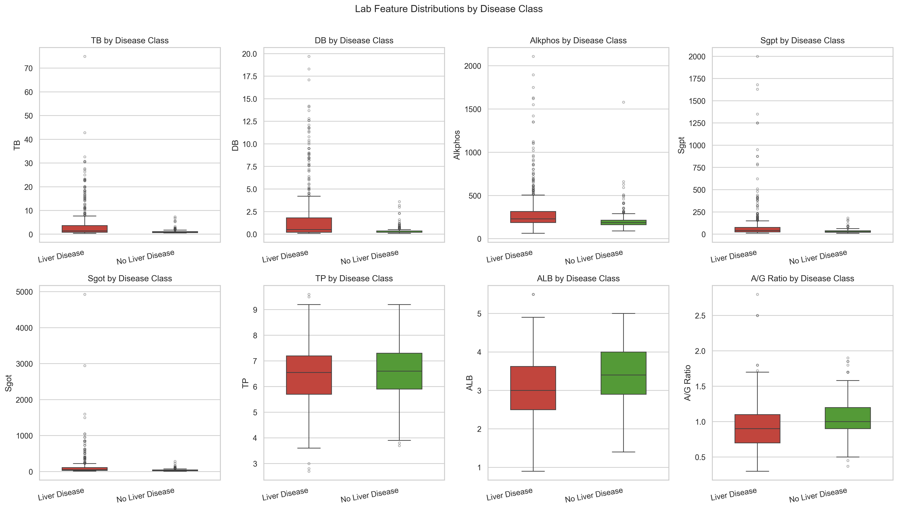

**Perbedaan Profil Biomarker per Gender**: Analisis korelasi per subkelompok gender (Gambar 4) menunjukkan bahwa:
- Alkphos merupakan fitur berbeda secara signifikan antara laki-laki dan perempuan
- DB memiliki separabilitas yang lebih lemah pada pasien perempuan dibandingkan laki-laki
- Pola ini mengindikasikan bahwa fitur-fitur prediktif tidak berperilaku identik across gender

**Korelasi Fitur**: Matriks korelasi (Gambar 5) menunjukkan korelasi tinggi antara TB dan DB (r ≈ 0,87), serta antara Sgpt dan Sgot (r ≈ 0,79), yang mendukung keputusan penambahan fitur rasio `fractional_bilirubin`.

**Gambar 5.** Matriks korelasi antar fitur.

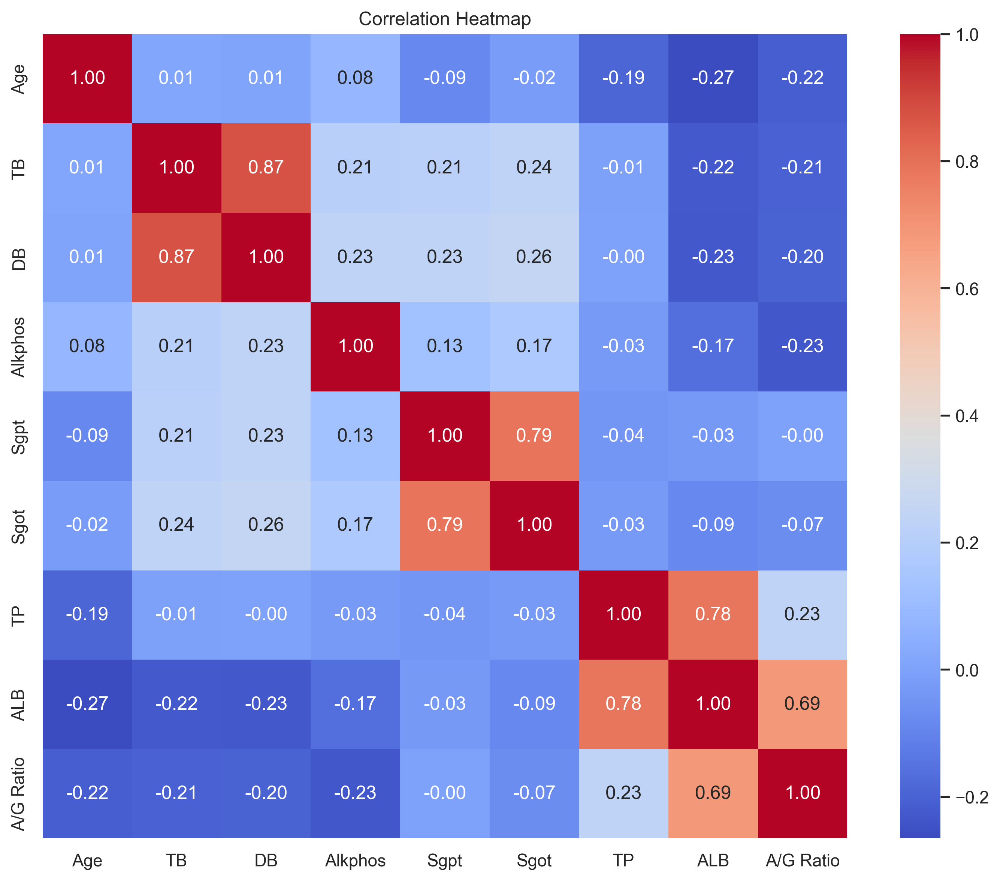

### 4.2 Performa Model Global

Tabel berikut merangkum performa model pada data uji keseluruhan (n=117):

**Tabel 5. Performa Model Global — Data Uji Keseluruhan**

| Eksperimen | Model | Akurasi | Presisi | Recall | F1-score | AUC-ROC |
|---|---|---|---|---|---|---|
| Exp1 | Logistic Regression | 0,6752 | 0,9592 | 0,5663 | 0,7121 | 0,7835 |
| Exp1 | Random Forest | 0,7179 | 0,7604 | 0,8795 | 0,8156 | 0,7849 |
| Exp1 | XGBoost | 0,7350 | 0,8023 | 0,8313 | 0,8166 | 0,7860 |
| Exp2 | Logistic Regression | 0,6752 | 0,9592 | 0,5663 | 0,7121 | 0,7838 |
| Exp2 | Random Forest | 0,7179 | 0,7604 | 0,8795 | 0,8156 | 0,7826 |
| **Exp2** | **XGBoost** | **0,7692** | **0,8256** | **0,8554** | **0,8402** | **0,7782** |
| Exp3 (♂) | Logistic Regression | 0,7079 | 0,9333 | 0,6462 | 0,7636 | 0,8179 |
| Exp3 (♂) | Random Forest | 0,7753 | 0,7848 | 0,9538 | 0,8611 | 0,7917 |
| Exp3 (♂) | XGBoost | 0,7303 | 0,7662 | 0,9077 | 0,8310 | 0,7981 |
| Exp3 (♀) | Logistic Regression | 0,5000 | 0,8333 | 0,2778 | 0,4167 | 0,5611 |
| Exp3 (♀) | Random Forest | 0,7500 | 0,7619 | 0,8889 | 0,8205 | 0,7556 |
| Exp3 (♀) | XGBoost | 0,6786 | 0,7368 | 0,7778 | 0,7568 | 0,7778 |

**Model terbaik secara keseluruhan** adalah **XGBoost pada Eksperimen 2** (global tanpa fitur gender), dengan F1 = 0,8402, akurasi = 0,7692, dan AUC = 0,7782. Fakta bahwa menghilangkan fitur gender eksplisit justru meningkatkan performa global (F1 dari 0,8166 → 0,8402 untuk XGBoost dari Exp1 ke Exp2) mengindikasikan bahwa fitur gender yang terkode secara biner dapat menambahkan *noise* ke dalam model XGBoost pada dataset berukuran kecil ini.

**Gambar 6.** Kurva ROC — Exp2 (semua model).

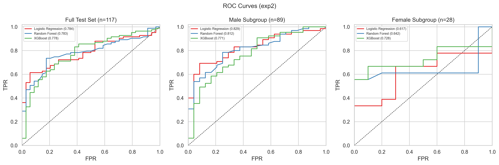

**Gambar 7.** Kurva Precision-Recall — Exp2 (semua model).

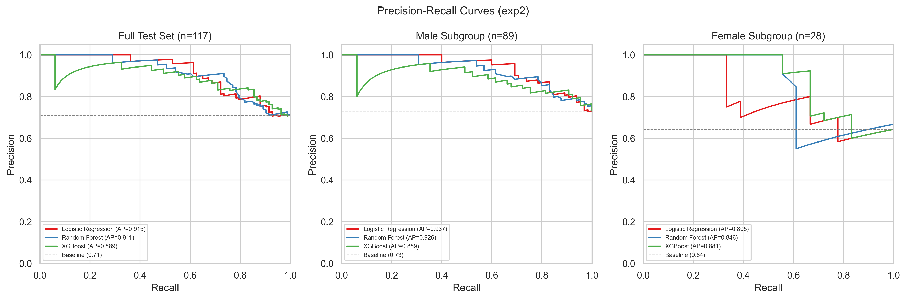

### 4.3 Analisis Fairness Berbasis Subkelompok Gender

Tabel berikut merangkum metrik *fairness* seluruh konfigurasi:

**Tabel 6. Metrik Fairness Antar Subkelompok Gender**

| Eksperimen | Model | Acc♂ | Acc♀ | ΔAcc | Recall♂ | Recall♀ | ΔRecall | FNR♀ | FNR♂ | ΔFNR |
|---|---|---|---|---|---|---|---|---|---|---|
| Exp1 | Logistic Regression | 0,7079 | 0,5714 | +0,1365 | 0,6308 | 0,3333 | +0,2975 | 0,6667 | 0,3692 | +0,2975 |
| Exp1 | Random Forest | 0,7753 | 0,5357 | +0,2396 | 0,9538 | 0,6111 | +0,3427 | 0,3889 | 0,0462 | +0,3427 |
| Exp1 | XGBoost | 0,7528 | 0,6786 | +0,0742 | 0,8615 | 0,7222 | +0,1393 | 0,2778 | 0,1385 | +0,1393 |
| Exp2 | Logistic Regression | 0,7079 | 0,5714 | +0,1365 | 0,6308 | 0,3333 | +0,2975 | 0,6667 | 0,3692 | +0,2975 |
| Exp2 | Random Forest | 0,7753 | 0,5357 | +0,2396 | 0,9538 | 0,6111 | +0,3427 | 0,3889 | 0,0462 | +0,3427 |
| Exp2 | XGBoost | 0,7978 | 0,6786 | +0,1192 | 0,9077 | 0,6667 | +0,2410 | 0,3333 | 0,0923 | +0,2410 |
| Exp3 | Logistic Regression | 0,7079 | 0,5000 | +0,2079 | 0,6462 | 0,2778 | +0,3684 | 0,7222 | 0,3538 | +0,3684 |
| **Exp3** | **Random Forest** | **0,7753** | **0,7500** | **+0,0253** | **0,9538** | **0,8889** | **+0,0649** | **0,1111** | **0,0462** | **+0,0649** |
| Exp3 | XGBoost | 0,7303 | 0,6786 | +0,0517 | 0,9077 | 0,7778 | +0,1299 | 0,2222 | 0,0923 | +0,1299 |

Keterangan: ΔRecall dan ΔFNR = nilai laki-laki dikurangi perempuan / FNR perempuan dikurangi FNR laki-laki (positif = laki-laki lebih diuntungkan)

**Temuan kunci:**

**1. Disparitas recall yang konsisten dan menyeluruh.** Seluruh 9 konfigurasi model-eksperimen menunjukkan nilai ΔRecall positif, artinya *recall* laki-laki selalu lebih tinggi dari perempuan. Ini mengindikasikan bahwa semua model lebih mampu mendeteksi pasien laki-laki yang sakit dibandingkan pasien perempuan yang sakit.

**2. FNR perempuan sangat bervariasi antar konfigurasi — dari 0,1111 hingga 0,7222.** Konfigurasi terburuk adalah Logistic Regression pada Exp3 dengan FNR perempuan = 0,7222, artinya 72,22% pasien perempuan yang sesungguhnya mengidap penyakit liver diprediksi negatif. Ini merupakan risiko klinis yang sangat serius: lebih dari dua pertiga perempuan yang sakit akan "lolos" dari skrining.

**3. XGBoost pada Exp1 memberikan disparitas terendah di antara model global.** Dengan ΔRecall = +0,1393 dan FNR perempuan = 0,2778, XGBoost pada Exp1 merupakan pilihan yang paling berimbang di antara model-model global yang diuji.

**4. Model terpisah per gender (Exp3) dengan Random Forest memberikan keadilan terbaik.** Random Forest pada Exp3 mencapai FNR perempuan = 0,1111 dan ΔRecall = +0,0649 — angka paling kecil di antara semua konfigurasi. Ini menunjukkan bahwa model yang dilatih khusus untuk subkelompok perempuan dapat secara substansial mengurangi ketimpangan prediksi.

**5. Menghilangkan fitur gender tidak menghilangkan disparitas.** Perbandingan Exp1 vs Exp2 menunjukkan bahwa disparitas pada Logistic Regression dan Random Forest tidak berubah sama sekali ketika fitur gender dihilangkan (ΔRecall tetap +0,2975 dan +0,3427). Hal ini menunjukkan bahwa ketimpangan melekat pada fitur-fitur klinis lainnya (seperti pola Alkphos dan DB yang berbeda per gender), bukan semata-mata karena kehadiran fitur gender eksplisit.

### 4.4 Analisis Confusion Matrix per Subkelompok

Tabel berikut merinci distribusi TP, TN, FP, dan FN untuk setiap subkelompok gender pada konfigurasi yang relevan:

**Tabel 7. Detail Confusion Matrix per Subkelompok Gender (Konfigurasi Terpilih)**

| Konfigurasi | Kelompok | TP | TN | FP | FN | FPR | FNR |
|---|---|---|---|---|---|---|---|
| Exp1 / LogReg | Perempuan | 6 | 10 | 0 | 12 | 0,0000 | 0,6667 |
| Exp1 / LogReg | Laki-laki | 41 | 22 | 2 | 24 | 0,0833 | 0,3692 |
| Exp1 / XGBoost | Perempuan | 13 | 6 | 4 | 5 | 0,4000 | 0,2778 |
| Exp1 / XGBoost | Laki-laki | 56 | 11 | 13 | 9 | 0,5417 | 0,1385 |
| Exp2 / XGBoost | Perempuan | 12 | 7 | 3 | 6 | 0,3000 | 0,3333 |
| Exp2 / XGBoost | Laki-laki | 59 | 12 | 12 | 6 | 0,5000 | 0,0923 |
| Exp3 / RF (♀) | Perempuan | 16 | 5 | 5 | 2 | 0,5000 | **0,1111** |
| Exp3 / RF (♂) | Laki-laki | 62 | 7 | 17 | 3 | 0,7083 | 0,0462 |

Data uji perempuan berjumlah 28 sampel (18 penyakit liver, 10 tanpa penyakit liver); data uji laki-laki berjumlah 89 sampel (65 penyakit liver, 24 tanpa penyakit liver).

Pada konfigurasi Logistic Regression Exp1, meskipun FPR perempuan = 0 (tidak ada prediksi salah untuk kelas negatif), FNR perempuan mencapai 0,6667 — menunjukkan *over-konservatisme* terhadap prediksi negatif yang mengakibatkan banyak pasien sakit yang terlewatkan.

### 4.5 Bootstrap Confidence Interval pada Recall Perempuan

Mengingat ukuran sampel perempuan yang kecil di data uji (n=28), nilai *recall* untuk subkelompok perempuan memiliki ketidakpastian yang lebih besar. Tabel berikut menyajikan interval kepercayaan 95% berbasis bootstrap untuk *recall* perempuan:

**Tabel 8. Bootstrap 95% CI untuk Recall Perempuan**

| Eksperimen | Model | Recall♀ | CI Bawah | CI Atas |
|---|---|---|---|---|
| Exp1 | Logistic Regression | 0,3333 | 0,1176 | 0,5716 |
| Exp1 | Random Forest | 0,6111 | 0,4373 | 0,8824 |
| Exp1 | XGBoost | 0,7222 | 0,5000 | 0,9333 |
| Exp2 | Logistic Regression | 0,3333 | 0,1175 | 0,5714 |
| Exp2 | Random Forest | 0,6111 | 0,3571 | 0,8421 |
| Exp2 | XGBoost | 0,6667 | 0,4444 | 0,8889 |
| Exp3 | Logistic Regression | 0,2778 | 0,0768 | 0,5000 |
| **Exp3** | **Random Forest** | **0,8889** | **0,8235** | **1,0000** |
| Exp3 | XGBoost | 0,7778 | 0,5714 | 0,9444 |

CI yang lebih sempit pada Exp3/Random Forest (0,8235–1,0000) mengindikasikan estimasi recall perempuan yang relatif stabil dan konsisten pada konfigurasi terbaik dari perspektif *fairness*.

### 4.6 Interpretabilitas: Feature Importance dan SHAP

#### 4.6.1 Feature Importance Global (Exp2 / XGBoost)

Analisis *feature importance* pada model terbaik global (Exp2 / XGBoost) menunjukkan bahwa fitur-fitur dengan kontribusi tertinggi adalah:

1. **DB (Direct Bilirubin)** — fitur paling penting secara konsisten
2. **TB (Total Bilirubin)** — korelasi tinggi dengan DB
3. **fractional_bilirubin** — fitur rekayasa yang berhasil merangkum rasio DB/TB
4. **Sgpt (ALT)** — enzim yang khas meningkat pada kerusakan sel hati
5. **Sgot (AST)** — enzim yang relevan untuk kerusakan jaringan hati

**Gambar 8.** Feature importance — Exp2 / XGBoost.

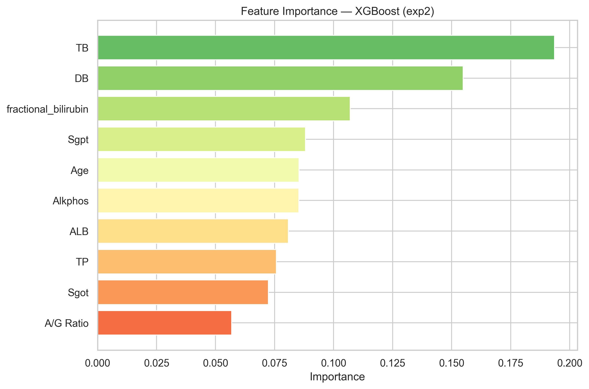

#### 4.6.2 Perbedaan Feature Importance per Gender (Exp3)

Perbandingan *feature importance* antara model laki-laki dan perempuan pada Exp3 menunjukkan perbedaan yang signifikan:

**Model Khusus Laki-laki (Exp3 / XGBoost):**
- DB dan Sgot mendominasi
- TB dan Sgpt berada di posisi menengah
- Usia (Age) memiliki kontribusi yang lebih kecil

**Model Khusus Perempuan (Exp3 / Random Forest):**
- Alkphos muncul sebagai fitur yang lebih dominan dibandingkan pada model laki-laki
- DB tetap relevan namun dengan bobot berbeda
- `fractional_bilirubin` memiliki kepentingan yang lebih tinggi relatif terhadap model laki-laki

**Gambar 10.** Feature importance — Exp3 / Random Forest (model khusus perempuan).

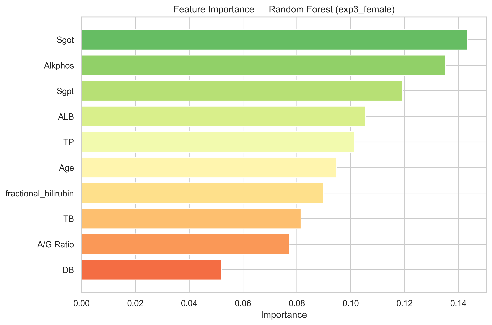

**Gambar 11.** Feature importance — Exp3 / XGBoost (model khusus laki-laki).

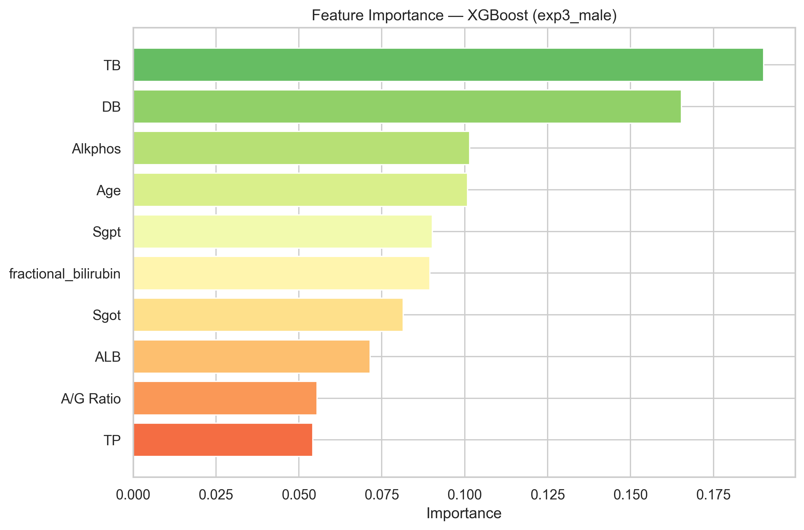

**Gambar 12.** SHAP summary plot — Exp3 / Random Forest (perempuan).

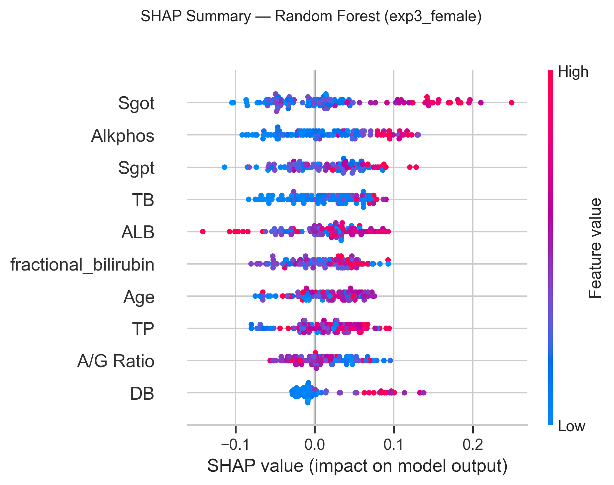

**Gambar 13.** SHAP summary plot — Exp3 / XGBoost (perempuan).

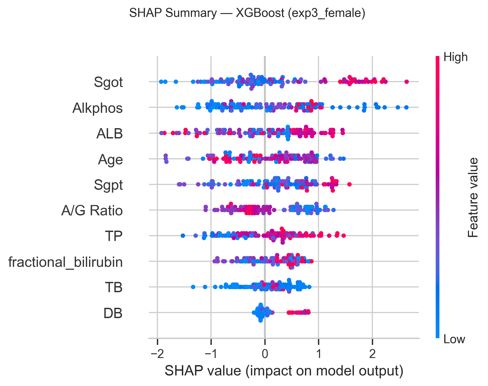

**Gambar 14.** SHAP summary plot — Exp3 / XGBoost (laki-laki).

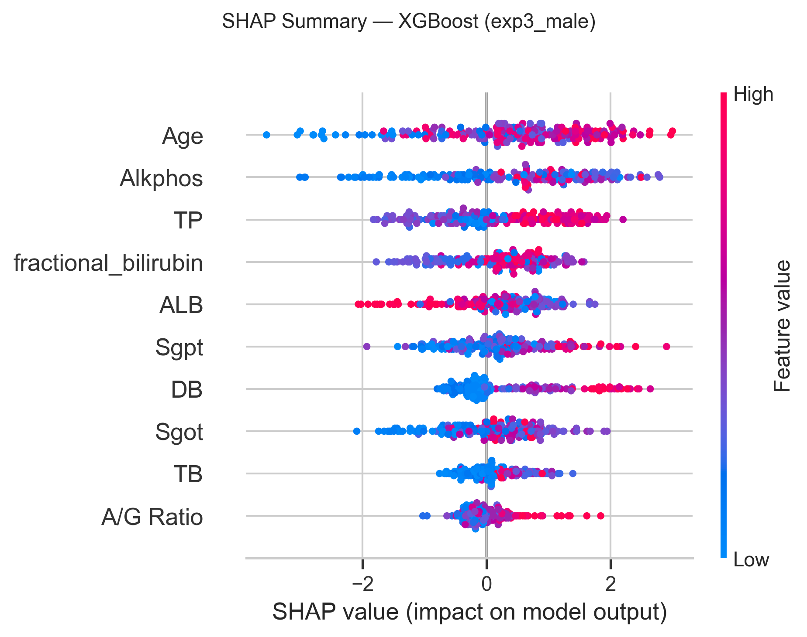

Perbedaan urutan kepentingan fitur antar gender ini memperkuat argumen bahwa biomarker hati berperilaku berbeda pada populasi laki-laki dan perempuan, dan mendukung alasan mengapa model terpisah per gender memberikan hasil yang lebih adil untuk subkelompok perempuan.

---

## 5. Diskusi

### 5.1 Keterbatasan Evaluasi Agregat

Hasil penelitian ini secara empiris mengonfirmasi bahwa evaluasi agregat model ML dapat menyembunyikan ketimpangan kinerja yang signifikan secara klinis. Model terbaik secara global (Exp2/XGBoost, F1=0,8402) memiliki FNR perempuan sebesar 0,3333 — artinya sepertiga pasien perempuan yang sakit tidak terdeteksi. Angka ini 3,6 kali lebih besar dari FNR model yang sama pada pasien laki-laki (FNR=0,0923).

Jika pengambil keputusan klinis hanya melihat F1 global (0,8402) tanpa memperhatikan metrik subkelompok, risiko ini tidak akan terdeteksi.

### 5.2 Implikasi Pemilihan Model dalam Konteks Kesehatan

Penelitian ini mengidentifikasi dua konfigurasi model yang relevan untuk deployment klinis:

1. **Model terbaik secara performa agregat**: Exp2/XGBoost (F1=0,8402, AUC=0,7782)  
   → Dipilih jika prioritas utama adalah kinerja keseluruhan dengan catatan pemantauan subkelompok diimplementasikan

2. **Model terbaik dari perspektif fairness**: Exp3/Random Forest — model khusus perempuan  
   → FNR perempuan = 0,1111, ΔRecall = +0,0649  
   → Dipilih jika prioritas utama adalah meminimalkan *missed diagnosis* pada pasien perempuan  
   → Recall perempuan = 0,8889 [95% CI: 0,8235–1,0000]

Dalam konteks skrining penyakit hati, yang umumnya mengutamakan sensitivitas (*recall*) tinggi untuk mencegah *missed diagnosis*, pendekatan model terpisah per gender dengan Random Forest menjadi pilihan yang lebih kuat secara etis dan klinis.

### 5.3 Mengapa Menghilangkan Fitur Gender Tidak Cukup

Temuan bahwa disparitas *recall* tidak berkurang setelah fitur gender dihapus dari model (Exp1 vs Exp2 untuk Logistic Regression dan Random Forest) merupakan salah satu temuan terpenting dalam penelitian ini. Ini menunjukkan bahwa informasi gender "terserap" ke dalam pola distribusi fitur lain seperti Alkphos, DB, dan kadar protein. Pendekatan *fairness-through-unawareness* (menghilangkan fitur sensitif) tidak efektif pada kasus ini; dibutuhkan intervensi yang lebih aktif seperti pelatihan model terpisah atau teknik *fairness-constrained learning*.

### 5.4 Keterbatasan Penelitian

1. **Ukuran dataset yang kecil**: 583 sampel secara keseluruhan, dengan subkelompok perempuan hanya 142 sampel. Ini membatasi stabilitas estimasi performa dan menghasilkan CI yang lebar pada beberapa konfigurasi.
2. **Ketidakseimbangan gender**: Rasio 3:1 (laki-laki:perempuan) menyebabkan model mungkin cenderung menggeneralisasi pada pola laki-laki.
3. **Bias geografis dan demografi**: Dataset bersumber dari India Utara, sehingga hasil mungkin tidak dapat digeneralisasi ke populasi dengan profil biomarker berbeda.
4. **Tidak adanya validasi eksternal**: Kinerja model belum divalidasi pada dataset dari institusi dan populasi berbeda.

---

## 6. Kesimpulan

Penelitian ini menginvestigasi apakah model ML untuk prediksi penyakit liver menunjukkan perbedaan kinerja yang signifikan antara subkelompok laki-laki dan perempuan. Berdasarkan eksperimen terhadap *Indian Liver Patient Dataset* dengan tiga algoritma dan tiga skenario desain eksperimen, empat simpulan utama dapat diambil:

1. **Model terbaik secara agregat** adalah XGBoost pada Eksperimen 2 (tanpa fitur gender eksplisit), dengan F1 = 0,8402, akurasi = 0,7692, dan AUC = 0,7782.

2. **Disparitas kinerja berbasis gender bersifat konsisten dan sistematis.** Seluruh sembilan konfigurasi model menunjukkan *recall* laki-laki yang lebih tinggi dari perempuan tanpa pengecualian. Disparitas ini bervariasi dari ΔRecall = +0,0649 hingga +0,3684 tergantung konfigurasi.

3. **Menghilangkan fitur gender sebagai input tidak mengeliminasi disparitas.** Ketimpangan kinerja melekat pada distribusi fitur klinis, bukan hanya pada representasi eksplisit gender dalam model.

4. **Model terpisah per gender dengan Random Forest memberikan kesetaraan terbaik**, dengan FNR perempuan = 0,1111 dan selisih *recall* hanya +0,0649. Konfigurasi ini direkomendasikan untuk skenario klinis yang mengutamakan minimisasi *missed diagnosis* pada pasien perempuan.

Temuan-temuan ini menegaskan bahwa **evaluasi subkelompok harus dianggap wajib** dalam validasi model AI untuk aplikasi medis, dan metrik agregat saja tidak mencukupi untuk penilaian yang bertanggung jawab.

---

## 7. Saran Penelitian Lanjutan

Berdasarkan temuan dan keterbatasan penelitian ini, beberapa arah penelitian lanjutan direkomendasikan:

1. **Perluasan data**: Mengumpulkan dataset dengan representasi perempuan yang lebih seimbang, idealnya dari berbagai pusat layanan kesehatan dan populasi demografis yang beragam.
2. **Validasi eksternal**: Menguji model yang terlatih pada ILPD terhadap dataset independen dari wilayah berbeda untuk mengukur stabilitas generalisasi.
3. **Pemodelan dengan kendala fairness**: Mengevaluasi metode *threshold optimization* per subkelompok, *adversarial debiasing*, dan teknik *post-processing* untuk mengurangi kesenjangan FNR dengan dampak minimal pada performa agregat.
4. **Analisis utilitas klinis**: Menggabungkan *decision curve analysis* dan evaluasi berbasis biaya untuk mengkuantifikasi tradeoff yang dapat diterima antara FP dan FN dalam konteks skrining hati.
5. **Pelaporan ketidakpastian** yang diperluas: Memperluas bootstrap CI ke semua metrik subkelompok kunci dan melakukan analisis sensitivitas terhadap pilihan *random seed* dan strategi pemisahan data.

---

## Ucapan Terima Kasih

[Isi bagian ini dengan pengakuan terhadap institusi, pendanaan, atau pihak yang berkontribusi pada penelitian]

---

## Daftar Pustaka

[1] D. Dheeru and E. Karra Taniskidou, "UCI Machine Learning Repository — Indian Liver Patient Dataset," 2017. [Online]. Available: https://archive.ics.uci.edu/ml/datasets/ILPD+(Indian+Liver+Patient+Dataset)

[2] B. V. Ramana, M. S. Prasad Babu, and N. B. Venkateswarlu, "A Critical Study of Selected Classification Algorithms for Liver Disease Diagnosis," *International Journal of Database Management Systems*, vol. 3, no. 2, pp. 101–114, 2011.

[3] B. Bendi Venkata Ramana and M. S. Prasad Babu, "Liver Classification Using Modified Rotation Forest," *International Journal of Engineering Research and Technology*, vol. 1, no. 9, 2012.

[4] S. Obermeyer, B. Powers, C. Vogeli, and S. Mullainathan, "Dissecting racial bias in an algorithm used to manage the health of populations," *Science*, vol. 366, no. 6464, pp. 447–453, 2019.

[5] S. Barocas, M. Hardt, and A. Narayanan, *Fairness and Machine Learning: Limitations and Opportunities*. fairmlbook.org, 2019.

[6] M. Hardt, E. Price, and N. Srebro, "Equality of Opportunity in Supervised Learning," in *Advances in Neural Information Processing Systems*, vol. 29, 2016.

[7] T. Chen and C. Guestrin, "XGBoost: A scalable tree boosting system," in *Proc. 22nd ACM SIGKDD Int. Conf. on Knowledge Discovery and Data Mining*, 2016, pp. 785–794.

[8] L. Breiman, "Random Forests," *Machine Learning*, vol. 45, no. 1, pp. 5–32, 2001.

[9] S. M. Lundberg and S.-I. Lee, "A Unified Approach to Interpreting Model Predictions," in *Advances in Neural Information Processing Systems*, vol. 30, 2017.

[10] V. N. Vapnik, *The Nature of Statistical Learning Theory*. New York: Springer, 1995.

[11] A. M. Albarqouni et al., "Gender differences in liver disease and the drug-dose gender gap," *JHEP Reports*, vol. 4, no. 2, 2022.

[12] [CITE pustaka lain yang relevan — sesuaikan dengan jurnal target]

---

*Naskah ini disusun berdasarkan hasil eksperimen penuh menggunakan pipeline CRISP-DM yang telah dijalankan pada dataset ILPD. Seluruh angka metrik yang disebutkan dalam naskah bersumber langsung dari output pipeline dan dapat direproduksi menggunakan kode sumber yang tersedia.*
